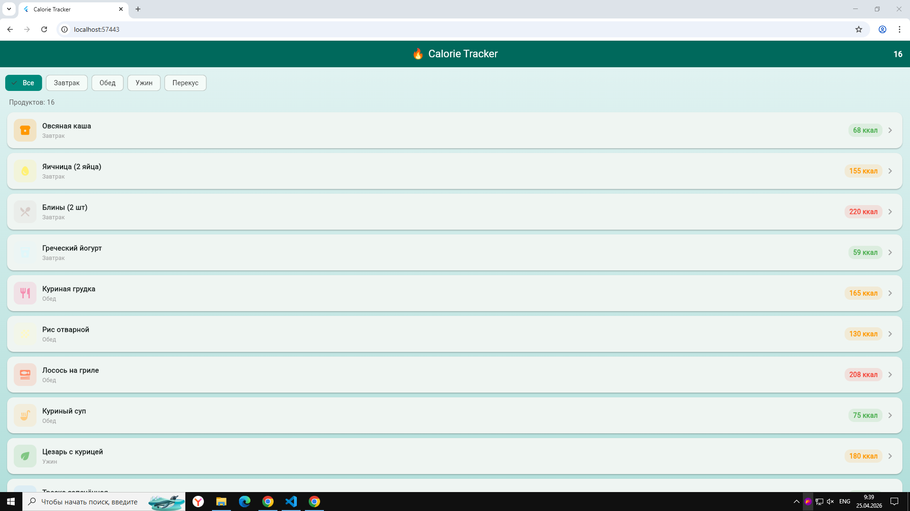
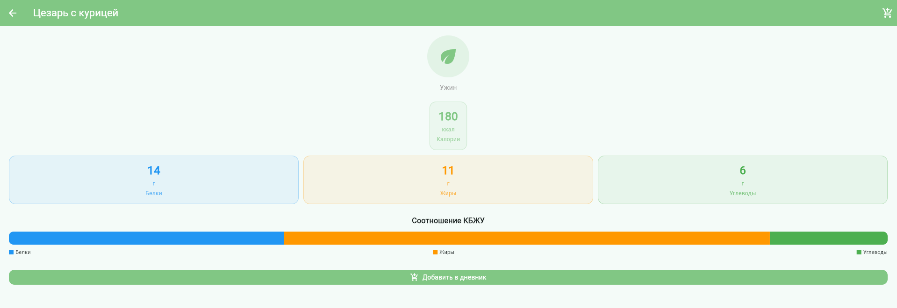
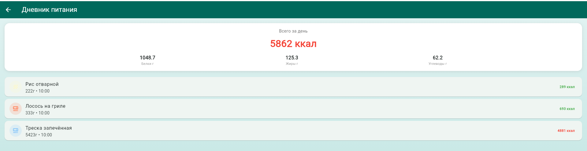

# Calorie Tracker

Приложение для учёта калорий с каталогом продуктов и дневником питания.

# Автор
Горишний Д.О.
Группа ИСП-232

# Стек
- Flutter 
- Dart 
- Web (Chrome)

# Скриншоты

## Запуск проекта

## Клонирование репозитория
git clone <репозиторий>
cd calorie_tracker

## Установка зависимостей
flutter pub get

## Запуск в браузере
flutter run -d chrome

## Функционал

### Главный экран

- Отображение списка продуктов в виде карточек
- Фильтрация по категориям через `ChoiceChip`
- Счётчик отфильтрованных продуктов
- Кнопка перехода в дневник
- Долгое нажатие для добавления в дневник
- `FloatingActionButton` при наличии записей в дневнике

### Детальный экран продукта

- Иконка и категория продукта
- Калорийность на 100г
- Белки, жиры, углеводы (КБЖУ)
- Визуализация соотношения КБЖУ через цветную полосу
- Кнопка добавления в дневник

### Дневник питания

- Список добавленных продуктов с весом и временем
- Итоговая статистика за день:
  - Суммарные калории
  - Белки, жиры, углеводы
- Цветовая индикация суточной нормы калорий

## Особенности реализации

### Визуализация

- Цветовое кодирование: зелёный (меньше 100 ккал), оранжевый (меньше 200 ккал), красный (больше или равно 200 ккал)
- Пропорциональная полоса КБЖУ на основе энергетической ценности:
  - Белки: умножить на 4
  - Жиры: умножить на 9
  - Углеводы: умножить на 4

### Взаимодействие

- Навигация между экранами через `Navigator.push()`
- Передача данных через параметры виджетов
- Диалоговое окно для ввода веса порции
- `SnackBar` для уведомлений о добавлении
- Обновление UI через `setState()`

## Изученные концепции

| Концепция | Применение |
|-----------|------------|
| `final` и `const` | Поля моделей и списки данных |
| Геттеры (computed properties) | `kcalPerGram`, `totalCalories` |
| Модели данных | `FoodItem`, `DiaryEntry` |
| Фильтрация списков | `ChoiceChip` и метод `where()` |
| Навигация | `Navigator.push()` и `MaterialPageRoute` |
| Передача колбэков | `VoidCallback` для связи экранов |
| Состояние виджета | `StatefulWidget` и `setState()` |
| Диалоги | `showDialog()` и `AlertDialog` |
| Уведомления | `ScaffoldMessenger.showSnackBar()` |

